# BAGO Backend — Mapa de Arquitectura

## Mermaid: Archivo → Módulo → Responsabilidad

```mermaid
graph TD
    subgraph ROOT["📁 Raíz — Entrypoints"]
        R1["bago / bago.cmd / bago.ps1\nCLI launcher multiplataforma"]
        R2["protocol.py\nDefinición del protocolo IR"]
        R3["registry.py\nRegistro global de componentes"]
        R4["ir_types.py\nTipos del protocolo IR"]
        R5["version.py / release_version.txt\nVersión del sistema"]
        R6["install-v4.ps1 / install-assistant.ps1\nInstaladores PowerShell"]
        R7["open-electron-bago.cmd / open-ui-bago.cmd\nLanzadores de escritorio"]
    end

    subgraph API[".bago/api — Capa HTTP"]
        A1["api_routes.py\nRegistro de rutas HTTP"]
        A2["api_dispatch.py\nDispatcher central de peticiones"]
        A3["api_auth.py\nAutenticación y tokens"]
        A4["api_state.py\nEstado global de la API"]
        A5["api_serializers.py\nSerialización de respuestas"]
        A6["bridge.py\nBridge interno API↔Core"]
        A7["rate_limit.py\nControl de tasa"]
        A8["request_context.py\nContexto por petición"]
        A9["structured_log.py\nLogging estructurado"]

        subgraph HANDLERS[".bago/api/handlers_*"]
            H1["handlers_workspace.py\nPermisos workspace · canChat · binding"]
            H2["handlers_chat.py / handlers_chat_stream.py\nChat · streaming SSE"]
            H3["handlers_providers.py / handlers_models.py\nProveedores LLM · modelos disponibles"]
            H4["handlers_session.py\nGestión de sesiones"]
            H5["handlers_status.py / handlers_health.py\nEstado del sistema · health checks"]
            H6["handlers_command.py / handlers_interpret.py\nEjecución de comandos · interpretación"]
            H7["handlers_evidence.py / handlers_audit.py\nEvidencia · auditoría"]
            H8["handlers_files.py / handlers_memory.py\nArchivos · memoria persistente"]
            H9["handlers_router.py / handlers_routes.py\nRouter dinámico · rutas declarativas"]
            H10["handlers_jobs.py / handlers_schedule.py\nJobs · planificación"]
            H11["handlers_subagents.py / handlers_simulation.py\nSubagentes · simulación"]
            H12["handlers_ui_bootstrap.py\nBootstrap snapshot para la UI"]
            H13["handlers_project.py / handlers_menu.py\nProyecto · menú contextual"]
            H14["handlers_history.py / handlers_rl.py\nHistorial · refuerzo RL"]
            H15["handlers_switch.py / handlers_catalog.py\nSwitch de providers · catálogo"]
        end
    end

    subgraph CORE[".bago/core — Motor del Framework"]
        subgraph SESSION["Sesión (mixins)"]
            S1["session_manager.py\nGestor principal de sesiones"]
            S2["session_persistence_mixin.py\nPersistencia · binding_state acumulado"]
            S3["session_context_mixin.py\nContexto de sesión"]
            S4["session_context_envelope_mixin.py\nEnvolvente de contexto"]
            S5["session_context_workspace_mixin.py\nContexto de workspace"]
            S6["session_context_policy_mixin.py\nPolítica de contexto"]
            S7["session_tools_mixin.py\nHerramientas en sesión"]
            S8["session_turn_mixin.py\nGestión de turnos"]
            S9["session_adapters_mixin.py\nAdaptadores de sesión"]
            S10["session_db.py\nBase de datos de sesión"]
            S11["session_utils.py\nUtilidades de sesión"]
        end

        subgraph WORKSPACE["Workspace / Binding"]
            W1["workspace_binding.py\nResolución y confirmación de binding\n(.gabo como canónico)"]
            W2["gabo_connector.py\nConector con .gabo workspace"]
            W3["state_paths.py\nRutas de estado del sistema"]
            W4["directory_context.py\nContexto de directorio activo"]
        end

        subgraph CONTEXT["Contexto / Presupuesto"]
            C1["context_envelope.py\nEnvolvente de contexto IR"]
            C2["context_budget.py\nPresupuesto de tokens"]
            C3["context_compressor.py\nCompresión de contexto"]
            C4["context_store.py\nAlmacén de contexto"]
            C5["context_governance.py\nGobernanza de contexto"]
            C6["context_patterns.py\nPatrones de contexto"]
            C7["context_receipt_validator.py\nValidación de receipts"]
        end

        subgraph PROVIDERS["Providers / Modelos"]
            P1["provider_adapter.py\nAdaptador universal de providers"]
            P2["ollama_discovery.py\nDescubrimiento automático Ollama"]
            P3["model_equivalence.py\nEquivalencia entre modelos"]
            P4["credential_manager.py\nGestión de credenciales"]
            P5["message_adapter.py\nAdaptación de mensajes LLM"]
        end

        subgraph AGENTS["Agentes / Ejecución"]
            AG1["agent_dispatcher.py\nDispatcher de agentes"]
            AG2["agent_gateway.py\nGateway de entrada a agentes"]
            AG3["autonomous_loop.py\nBucle autónomo de agentes"]
            AG4["plan_engine.py\nMotor de planificación"]
            AG5["intent_engine.py\nMotor de intenciones"]
            AG6["switch_engine.py\nSwitch de providers en caliente"]
        end

        subgraph TOOLS["Tools / Guardrails"]
            T1["tool_registry.py\nRegistro de herramientas disponibles"]
            T2["guardrails.py\nGuardrails de seguridad"]
            T3["script_registry.py\nRegistro de scripts ejecutables"]
            T4["config_manager.py\nGestión de configuración"]
            T5["runtime.py\nRuntime principal del framework"]
        end

        subgraph RL_AUDIT["RL / Auditoría"]
            RL1["rl_engine.py\nMotor de reinforcement learning"]
            RL2["reflexive_interpreter.py\nInterpretador reflexivo"]
            RL3["reflexive_audit_ledger.py\nLedger de auditoría reflexiva"]
            RL4["learning_writer.py\nEscritor de aprendizaje"]
            RL5["embedding_store.py\nAlmacén de embeddings"]
            RL6["knowledge_base.py\nBase de conocimiento"]
        end
    end

    subgraph BAGO_CORE["bago_core/ — CLI & Ejecución"]
        subgraph COMMANDS["bago_core/commands/"]
            CMD1["cmd_chat.py\nComando chat CLI"]
            CMD2["cmd_provider.py\nComando providers CLI"]
            CMD3["cmd_route_v2.py\nComando route CLI"]
            CMD4["cmd_system.py\nComando system CLI"]
            CMD5["cmd_tools.py\nComando tools CLI"]
            CMD6["cmd_doctor.py\nDiagnóstico del sistema"]
            CMD7["cmd_lifecycle.py\nCiclo de vida CLI"]
            CMD8["cmd_content.py\nContenido CLI"]
        end

        subgraph EXECUTION["bago_core/execution/"]
            EX1["process_runner.py\nEjecución de procesos externos"]
            EX2["atomic_patch.py\nPatch atómico con rollback"]
            EX3["staging_workspace.py\nWorkspace de staging"]
        end

        subgraph CODEGEN["bago_core/codegen/"]
            CG1["Generación de código\nassistida por LLM"]
        end

        subgraph TRANSLATORS["bago_core/translators/"]
            TR1["Traducción de protocolos\nentre versiones IR"]
        end

        subgraph VALIDATION["bago_core/validation/"]
            VA1["Validación de contratos\ny esquemas IR"]
        end

        BCLI["cli.py\nEntrypoint CLI principal"]
        BNODE["node_control.py + node_control_*.py\nControl del nodo BAGO (TUI + state)"]
        BEVI["evidence_*.py\nGeneración y export de evidencia"]
        BCLAIM["claim_*.py\nSistema de claims y ledger"]
        BSUP["bago_supervisor.py\nSupervisor de procesos"]
    end

    subgraph ELECTRON["electron/ — Shell Electron"]
        EL1["main.js / preload.js\nProceso principal Electron"]
        EL2["api-bridge\nBridge Electron↔Python API"]
    end

    subgraph SCRIPTS["scripts/ — Build & Packaging"]
        SC1["package_v4.py\nEmpaquetado v4 completo"]
        SC2["package_audit_bundle.py\nBundle de auditoría"]
        SC3["package_user_bundle.py\nBundle de usuario"]
        SC4["publish_release.py\nPublicación de releases"]
        SC5["bago_supervisor.py\nSupervisor (scripts)"]
        SC6["repair_routing_runtime.py\nReparación de routing"]
    end

    subgraph TESTS["tests/ — Suite de Tests"]
        TE1["test_canonical_contract_state.py\nContratos canónicos"]
        TE2["test_api_dispatch_route_meta.py\nDispatch y rutas"]
        TE3["test_project_binding.py\nBinding de workspace"]
        TE4["test_security_release.py\nSeguridad y evidencia"]
        TE5["test_f1_version_workspace.py\nVersión y workspace"]
        TE6["test_command_intents.py\nIntenciones de comandos"]
        TE7["test_translators.py\nTraductores"]
        TE8["test_e2e.py\nTests end-to-end"]
    end

    %% Flujo principal
    ROOT --> API
    API --> CORE
    CORE --> BAGO_CORE
    ELECTRON --> API
    SCRIPTS -.->|build| ROOT
    TESTS -.->|valida| API
    TESTS -.->|valida| CORE
```

## Resumen de módulos

| Módulo | Archivos | Responsabilidad |
|--------|----------|-----------------|
| `.bago/api/handlers_*` | 25 handlers | Lógica HTTP por dominio (chat, workspace, providers, sessions…) |
| `.bago/api/` (infra) | 9 archivos | Routing, dispatch, auth, serialización, rate-limit |
| `.bago/core/session_*` | 11 mixins | Sesiones, persistencia, turnos, contexto, tools |
| `.bago/core/workspace` | 4 archivos | Binding `.gabo`, resolución de rutas, estado workspace |
| `.bago/core/context_*` | 7 archivos | Presupuesto, compresión, gobernanza de contexto |
| `.bago/core/providers` | 5 archivos | Adaptadores LLM, Ollama discovery, credenciales |
| `.bago/core/agents` | 6 archivos | Agentes autónomos, planificación, intenciones, switch |
| `.bago/core/tools` | 5 archivos | Tool registry, guardrails, config, runtime |
| `.bago/core/rl_audit` | 6 archivos | RL engine, reflexión, ledger de auditoría, embeddings |
| `bago_core/commands/` | 8 comandos | CLI commands (chat, provider, route, system, doctor…) |
| `bago_core/execution/` | 3 archivos | Process runner, atomic patch, staging |
| `bago_core/node_control*` | 12 archivos | Control del nodo (TUI, state, store, policy) |
| `bago_core/evidence_*` | 6 archivos | Generación, I/O y export de evidencia |
| `bago_core/claim_*` | 5 archivos | Sistema de claims y ledger |
| `electron/` | bridge + main | Shell Electron y bridge API↔UI |
| `scripts/` | 40+ archivos | Build, packaging, publish, repair |
| `tests/` | 8 suites | Contratos, binding, security, E2E |

## Archivos raíz conservados

| Archivo | Rol |
|---------|-----|
| `bago` / `bago.cmd` / `bago.ps1` | Launcher CLI multiplataforma |
| `protocol.py` | Protocolo IR (tipos de mensajes) |
| `registry.py` | Registro global de componentes |
| `ir_types.py` | Tipos del protocolo IR |
| `version.py` / `release_version.txt` | Versión del sistema |
| `install-v4.ps1` / `install-assistant.ps1` | Instaladores |
| `open-*.cmd` | Lanzadores de escritorio |
| `uninstall-bago.*` / `rollback-bago.ps1` | Desinstalación y rollback |
| `package.json` / `.gitignore` | Config del workspace |
| `manual.md` / `README.md` | Documentación |
