# BAGO — Manual operativo de la interfaz

> **Edición:** 4.10.0-dev · **Superficie:** Electron + React · **Idioma:** español

Este manual describe la interfaz actual del Control Plane. La sesión y el
backend son la autoridad; la UI muestra estados, propone acciones y recoge
confirmaciones. Un botón visible no significa que la acción esté autorizada:
comprueba siempre el estado que muestra BAGO y el resultado/receipt posterior.

## 1. Cómo leer la interfaz

Cada pantalla tiene cuatro capas:

1. **Encabezado global:** workspace, modelo, modo visual y ayuda.
2. **Sidebar:** destinos principales y paneles auxiliares.
3. **Superficie activa:** contenido de la sección seleccionada.
4. **Estado operativo:** preparación, backend, sesión, contexto y modelo.

Los estados se expresan como `confirmado`, `parcial`, `pendiente`, `bloqueado`,
`degradado` o `error`. `Pendiente` no es un fallo y `degradado` no equivale a
confirmado: abre el detalle y comprueba la acción disponible.

### Arranque recomendado

1. Abre BAGO y espera a que aparezca **Estado real de BAGO**.
2. Comprueba backend, sesión, proveedor/modelo y workspace.
3. Si el workspace pide atención, pulsa **Elegir proyecto**, selecciona la
   carpeta y confirma el vínculo; si BAGO propone sembrarlo, acepta solo si es
   la carpeta correcta.
4. Entra por **Inicio**. El chat solo se habilita cuando el backend confirma la
   sesión, el workspace y el modelo.

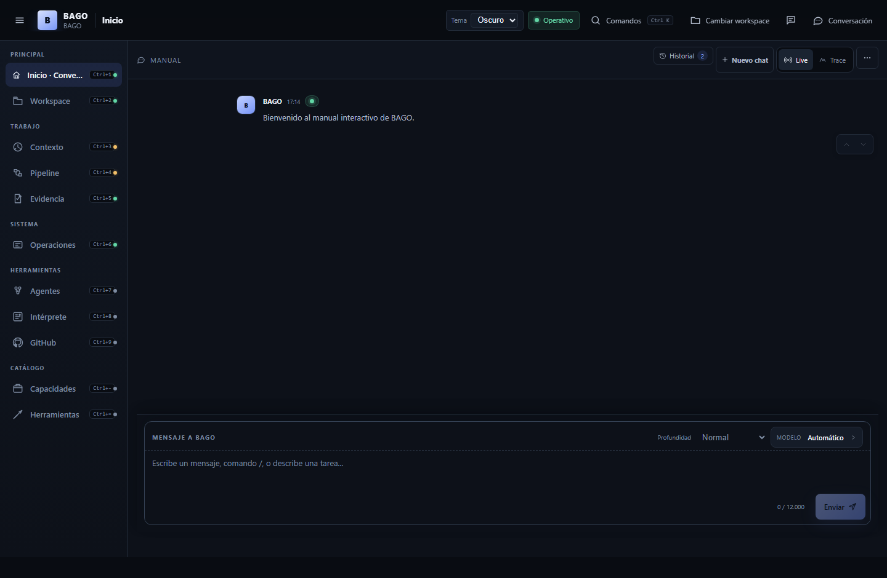

## 2. Inicio — conversación principal

Inicio es la única entrada conversacional visible. No existe un destino Chat
duplicado en el sidebar.

### Flujo normal de un mensaje

1. Escribe una petición en **Mensaje a BAGO**.
2. Pulsa **Enviar** o `Enter` (`Shift+Enter` inserta una nueva línea).
3. BAGO conserva la pregunta original, interpreta intención, objetivo,
   restricciones y ausencias, y muestra una tarjeta **Interpretación previa**
   dentro del propio turno.
4. El modelo recibe esa interpretación como contexto asesor y genera la
   contestación.
5. Comprueba la respuesta, el proveedor/modelo y el receipt del turno.

La interpretación se hace **una vez antes de la respuesta**. No se vuelve a
interpretar automáticamente después: una nueva interpretación solo procede en
el siguiente turno si cambia la petición, aparece contexto nuevo o el usuario
la solicita. La interpretación es provisional/asesora; el texto original del
usuario sigue siendo la autoridad.

En modo **Trace**, el backend envía esa misma interpretación como el primer
evento del stream, antes del primer fragmento de texto. Si el turno cae en una
ruta bloqueada o de respuesta completa, se recupera del `ContextReceipt`; en
ningún caso se ejecuta una segunda interpretación para pintar la tarjeta.

Ejemplo:

```text
Usuario: "Prepara un plan para corregir el arranque y compruébalo sin publicar."

Interpretación previa
- Intención: corregir / verificar
- Objetivo: preparar un plan ejecutable
- Restricción: no publicar

BAGO: [respuesta y pasos ejecutados, con evidencia o bloqueo explícito]
```

La tarjeta se puede desplegar para consultar intención, confianza, objetivo,
ausencias, restricciones e identificador de interpretación. El panel lateral
**Intérprete** queda reservado para inspección técnica o una pregunta de
interpretación independiente; no es un paso obligatorio del chat.

### Controles de Inicio

- **Historial:** abre conversaciones persistentes de la sesión.
- **Nuevo chat:** crea otra conversación dentro de la misma sesión/workspace.
- **Modelo de esta sesión:** fija un modelo para la sesión o vuelve a
  `Automático`; el cambio debe reflejarse en backend.
- **Profundidad:** selecciona automática, normal, media, alta o máxima.
- **Live / Trace:** Live muestra la respuesta normal; Trace muestra el flujo
  incremental cuando el provider lo admite.
- **Preparar plan:** aparece al escribir un borrador suficientemente largo y lo
  lleva al Pipeline para revisión; no ejecuta ni publica por sí mismo.
- **Enviar:** queda bloqueado si el backend, workspace, sesión o modelo no
  están confirmados.

### Estados que conviene recorrer

- Abre **Historial** y cambia entre una conversación activa y otra; confirma
  que título, contador y mensajes pertenecen a la misma sesión.
- Abre **Modelo de esta sesión**, inspecciona proveedor/modelo y cierra sin
  guardar si solo estabas comparando opciones.
- Prueba el estado bloqueado (sin workspace o backend no confirmado): el
  compositor debe explicar el motivo y no ofrecer una falsa ejecución.

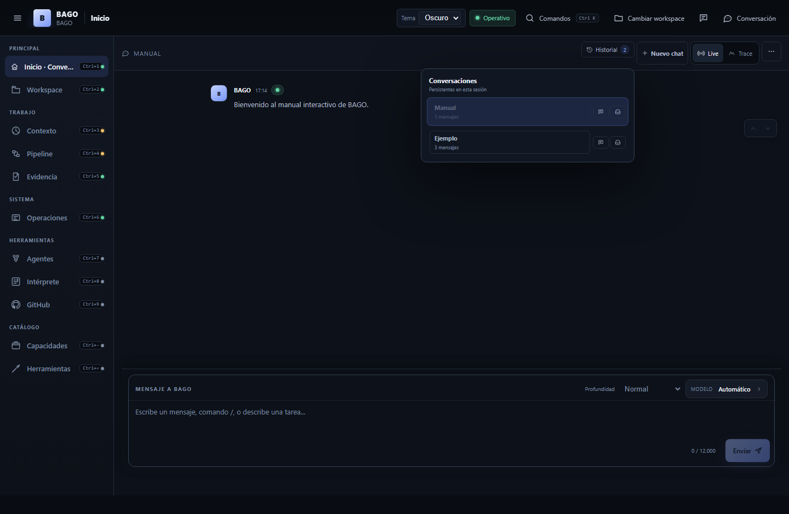

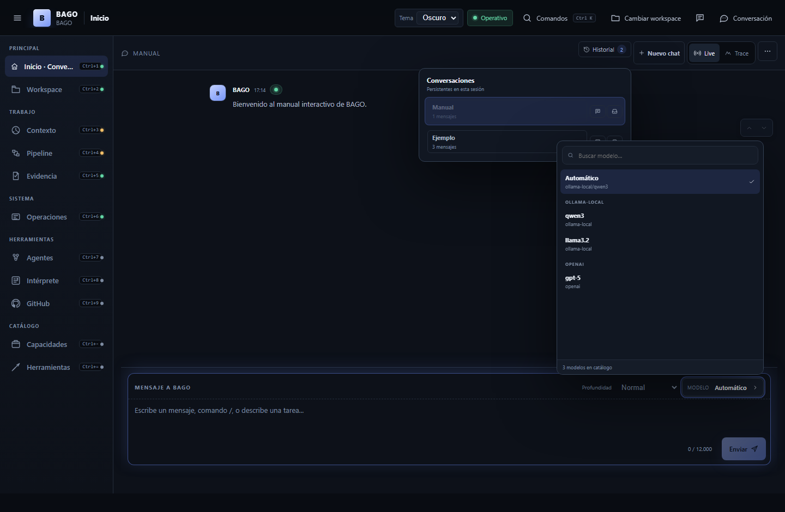

### Ejemplos de uso

```text
Pregunta informativa: "¿Qué archivos usa este workspace?"
Petición de trabajo: "Revisa backend/tests y dime qué falta, sin editar."
Ejecución autorizada: "Ejecuta el smoke de UI y devuelve el comando y la evidencia."
Ambigua: "Hazlo." -> BAGO debe pedir el dato que falta, no inventarlo.
```

## 3. Workspace — archivos y alcance

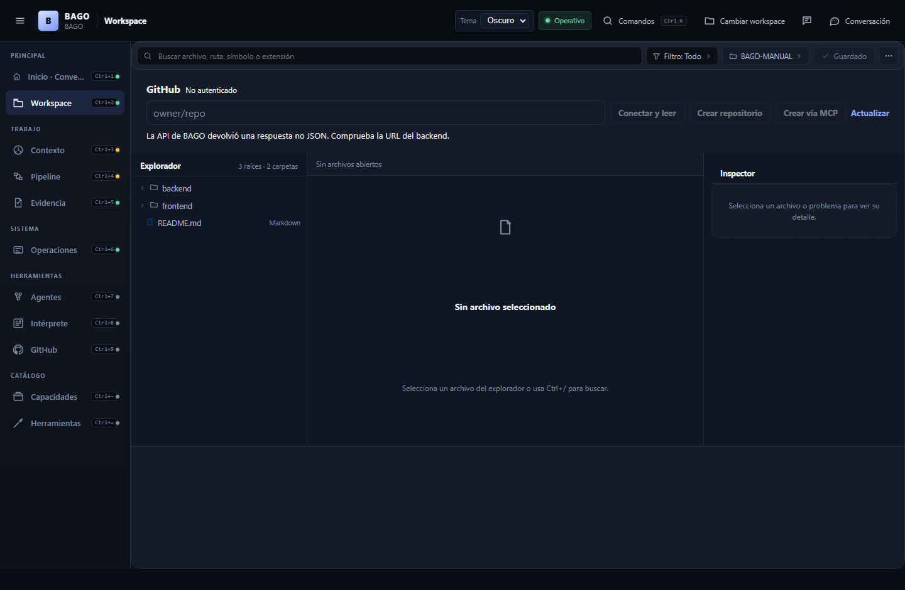

Workspace es el explorador del proyecto activo. Trabaja dentro del root
confirmado y separa archivos, directorios y fuentes.

### Operaciones

1. Usa el buscador para filtrar por nombre o ruta.
2. Usa el filtro de tipo para limitar a código, Python, JSON, web, shell o
   texto.
3. Expande un directorio y selecciona un archivo.
4. Lee el contenido en el panel derecho; los binarios se marcan como no
   legibles en vez de mostrarse como texto corrupto.
5. Abre el menú contextual del archivo para inspeccionar, copiar la ruta,
   abrirlo en el chat o enviarlo al árbol/banco de contexto.
6. Revisa el path y el workspace antes de aceptar una escritura.

### Estados internos del explorador

- **Sin selección:** el centro explica cómo elegir un archivo.
- **Archivo seleccionado:** aparecen pestaña, lenguaje, solo lectura,
  diagnósticos y el inspector asociado.
- **Menú contextual:** `Abrir`, `Copiar ruta`, `Copiar contenido`, `Enviar al
  Chat`, `Añadir al contexto` y `Crear plan` son acciones distintas.
- **Panel inferior:** `Problemas`, `Cambios`, `Patrones` y `Salida` se abren
  por separado; cada entrada permite saltar al origen o enviar el hallazgo a
  Chat/Contexto.

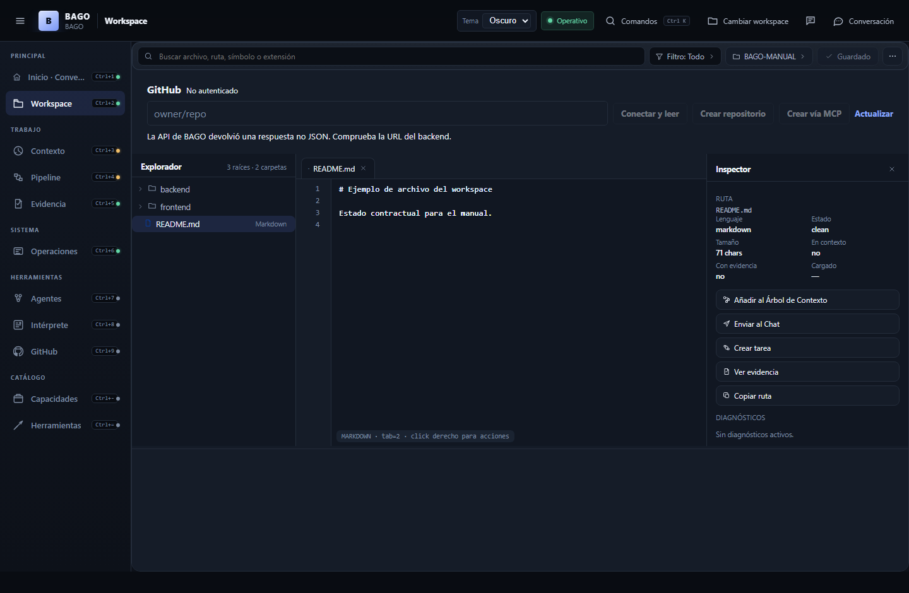

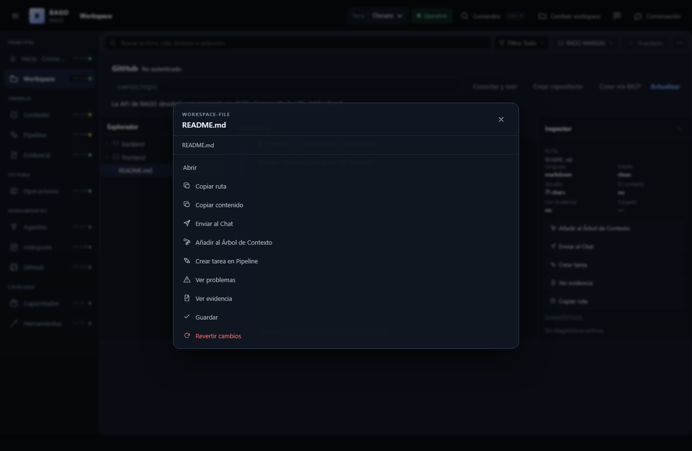

Ejemplo: filtra `*.py`, abre `backend/.bago/core/session_turn_mixin.py`, usa
**Inspeccionar** y después **Añadir al contexto**. El chat recibirá ese
elemento como contexto candidato, no como hecho confirmado.

## 4. Contexto — árbol, banco y API avanzada

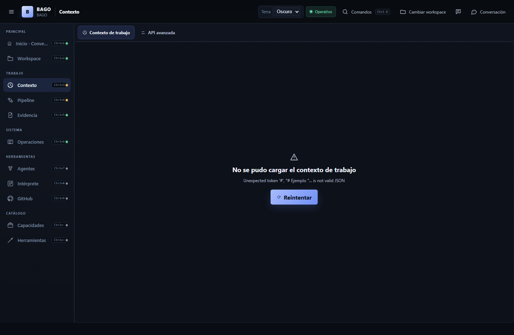

Contexto muestra qué material está preparado para una tarea y con qué estado.
Una propuesta que llega desde el chat requiere validación; aceptar una tarjeta
es distinto de certificar el contexto.

### Contexto de trabajo

- **Árbol:** navega por nodos de trabajo, claims, reglas y tareas pendientes.
- **Expandir/contraer:** reduce ruido cuando el árbol crece.
- **Seleccionar nodo:** abre el inspector con resumen, detalle o datos raw.
- **Aceptar/Rechazar/Revertir:** gobierna una propuesta concreta y deja su
  estado y receipt.
- **Banco:** recibe archivos, fuentes y reglas enviadas desde Workspace o Chat.

Ejemplo: después de que el chat proponga añadir “corregir el arranque” al
árbol, abre la tarjeta inline, revisa el resumen y pulsa **Aceptar** solo si el
texto representa exactamente la intención.

### API avanzada

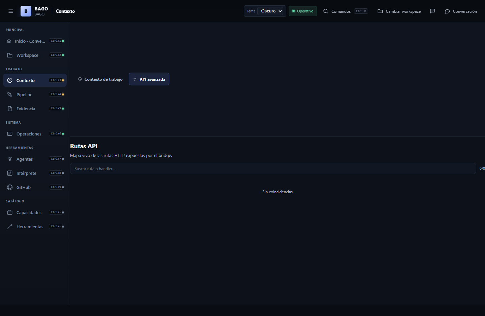

Esta pestaña es diagnóstica: muestra rutas y contratos disponibles para el
workspace. No sustituye las acciones guiadas ni autoriza por sí sola una
mutación.

### Recorrido de una propuesta

1. Selecciona un nodo y abre el inspector en nivel resumen, detalle y raw.
2. Cambia a **Propuestas** para distinguir `pending`, `accepted`, `rejected`,
   `edited` y `reverted`.
3. Abre **Receipts** y relaciona la mutación con su `receipt_id`.
4. En **Historial y receipts**, usa el timeline para comprobar orden y
   autoría. Los patches de riesgo alto requieren confirmación explícita.

## 5. Pipeline — de objetivo a ejecución

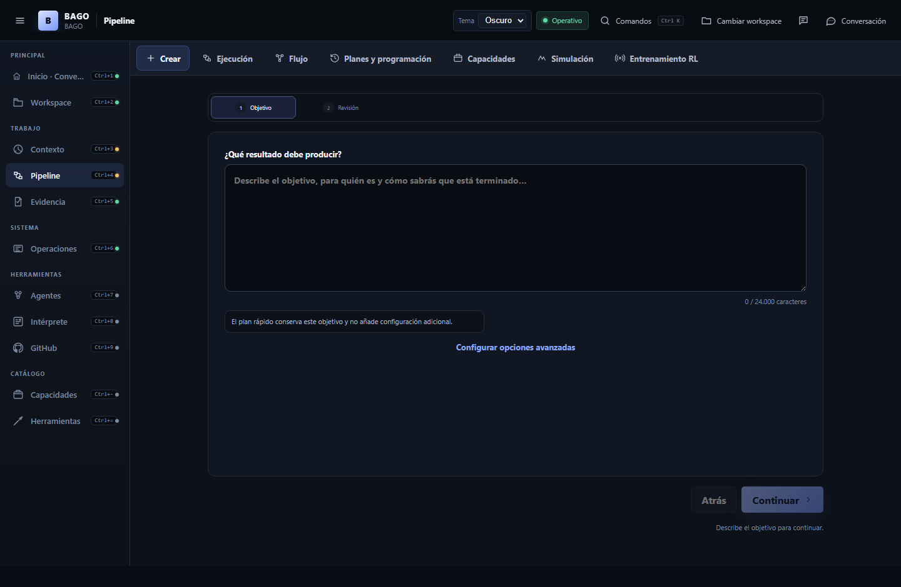

Pipeline convierte un objetivo en pasos revisables. La pestaña **Crear** es el
punto de entrada y debe terminar en una decisión explícita: preparar, ejecutar,
programar o bloquear.

### Crear

1. Elige una plantilla si aplica.
2. Escribe el objetivo concreto.
3. En modo rápido pulsa **Continuar** para revisar el objetivo; el origen
   avanzado no se impone automáticamente.
4. En modo avanzado aporta origen, restricciones y criterio de aceptación.
5. Revisa el resumen y crea el plan.

Ejemplo: `Capturar las pantallas de Operaciones, comprobar overflow y guardar
las evidencias`. Criterio: “capturas presentes, sin errores de consola y
manifest.json generado”.

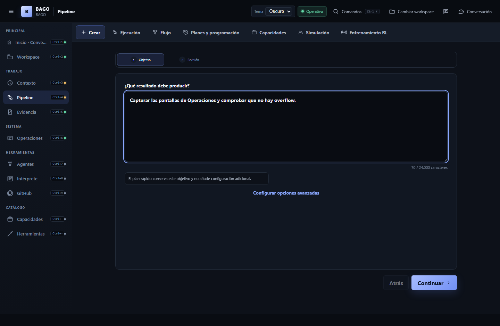

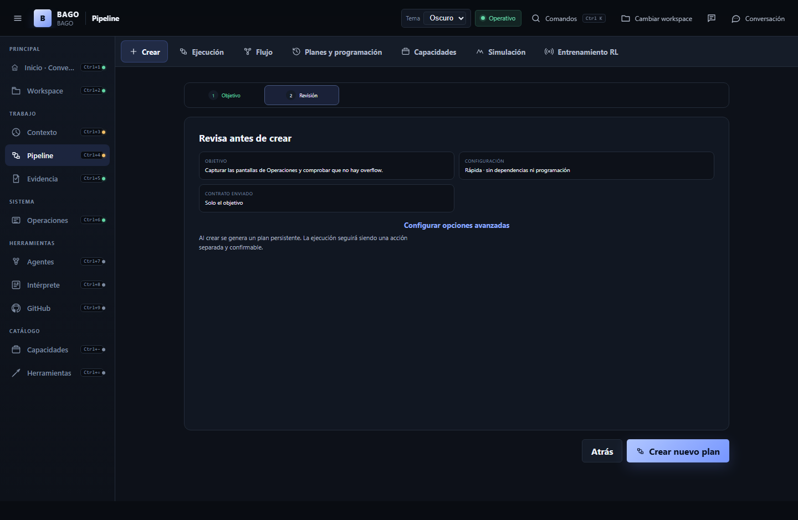

El estado **Objetivo escrito** todavía no crea nada. En **Revisa antes de
crear** comprueba contrato, dependencias, permisos, modelo y programación; la
ejecución sigue siendo una decisión posterior.

### Ejecución

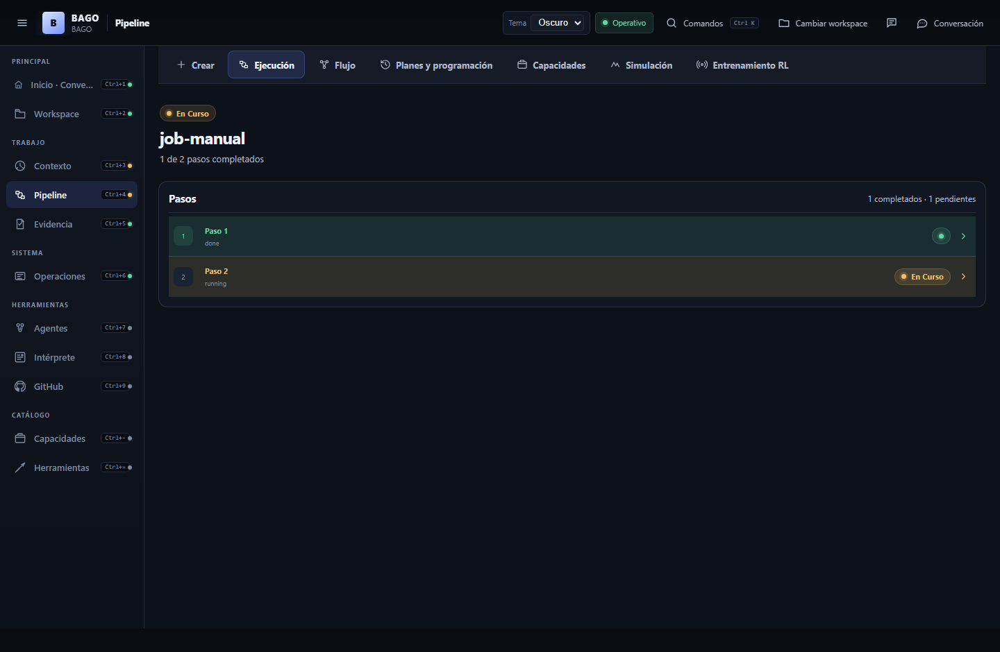

Muestra jobs, pasos, estado `running/done/failed/blocked`, tiempos y receipts.
Usa **Reintentar** solo cuando el bloqueo sea recuperable y **Detener** cuando
la política lo permita. Un job terminado sin evidencia no debe describirse como
verificado.

Recorre también `queued`, `running`, `done`, `failed` y `blocked`. En cada paso
comprueba si existe **Reintentar**, **Detener**, **Ver receipt** o una
explicación de bloqueo; sin receipt conserva el resultado como `PREPARED` o
`EXECUTED`, no como `VERIFIED`.

### Flujo

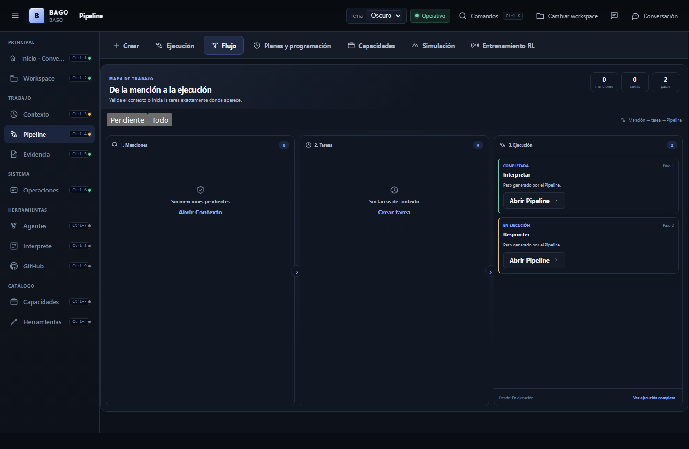

Representa dependencias y orden. Selecciona un nodo para abrir el inspector;
el grafo es una vista del plan, no una autoridad distinta.

### Planes y programación

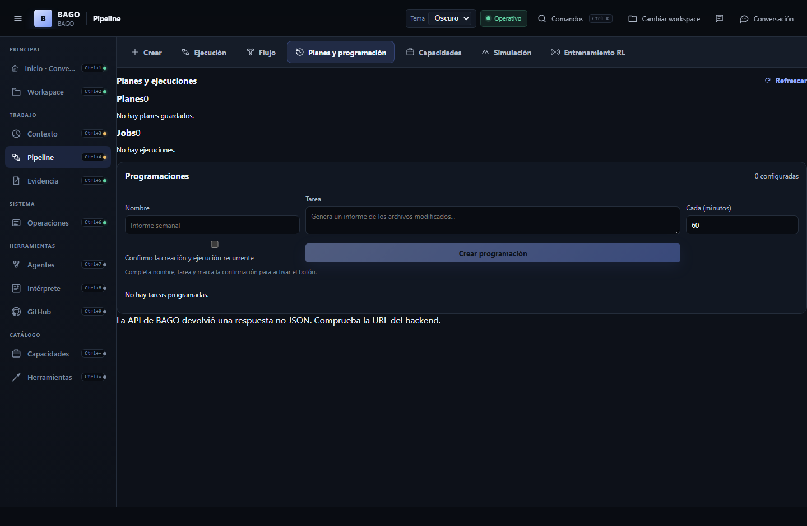

Guarda planes preparados y permite programar tareas cuando el backend ofrece esa
capacidad. Antes de programar confirma frecuencia, workspace, modelo y permiso.

### Capacidades

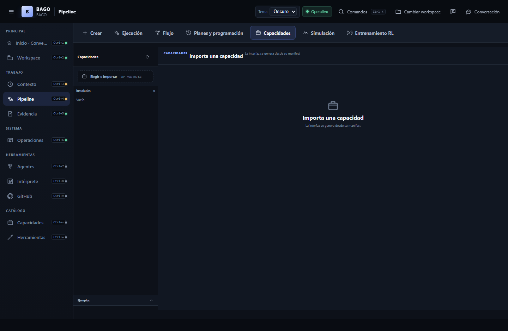

Enumera capacidades que el plan puede usar. `Disponible` no significa
`autorizada para este job`: comprueba restricciones y el estado del paso.

### Simulación

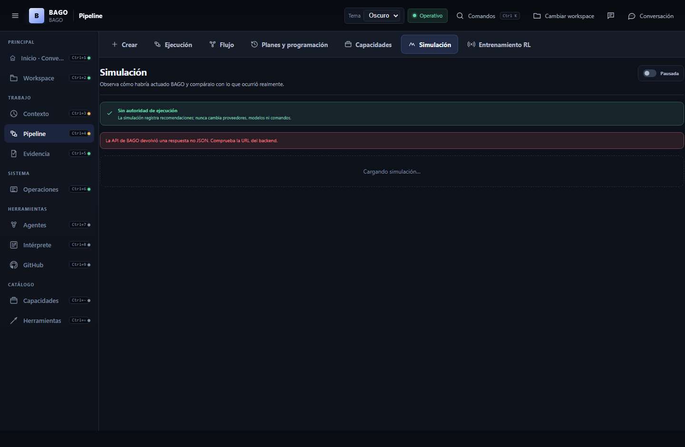

La simulación/shadow observa acciones y resultados sin tomar control autónomo.
Sirve para ensayar el flujo y revisar eventos antes de una ejecución real.

### Entrenamiento RL

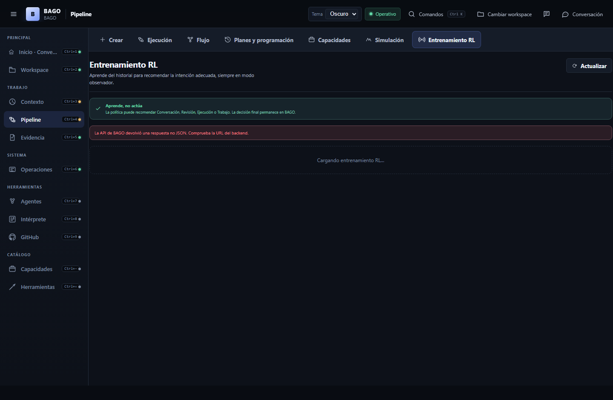

Muestra feedback y política de aprendizaje. No convierte una recomendación RL
en una orden ni eleva permisos.

## 6. Evidencia — receipts y auditoría

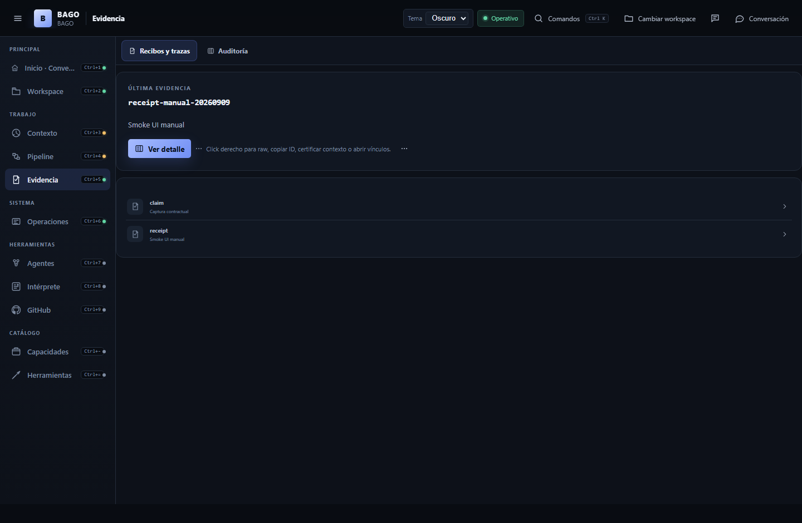

**Recibos y trazas** reúne la prueba de cada operación: sesión, workspace,
contexto, provider, modelo, resultado y timestamps.

Usa esta secuencia:

1. Localiza el receipt del turno/job.
2. Comprueba que pertenece a la sesión y workspace actuales.
3. Abre el detalle raw si necesitas reconstruir el contexto.
4. Separa `confirmed`, `inferred`, `assumed`, `unverified` y `blocked`.

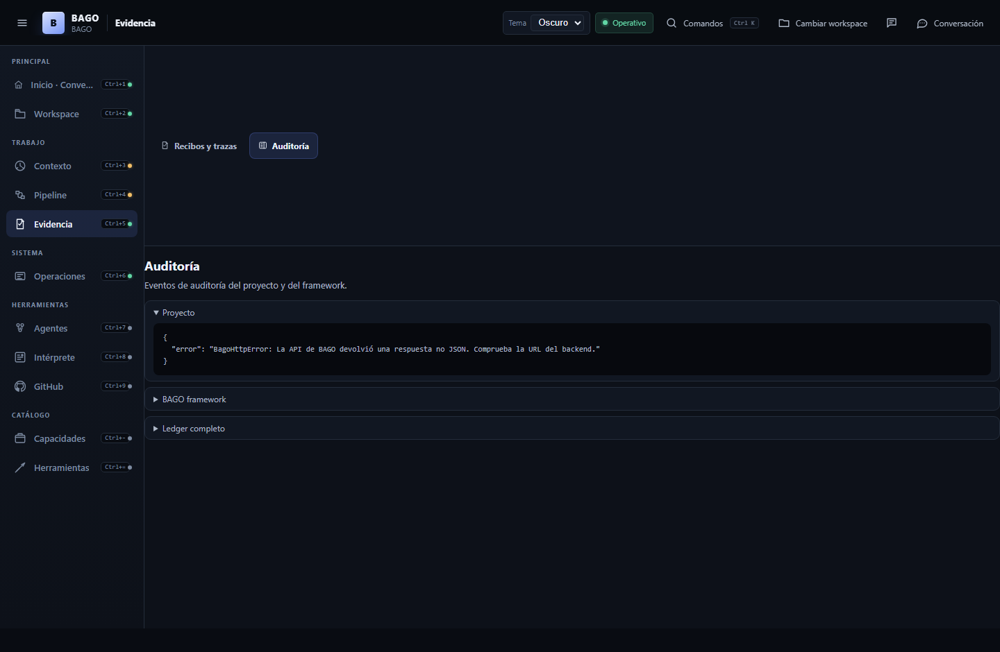

**Auditoría** presenta claims, riesgos y comprobaciones. Una captura o un
`CRIT_PASS` no certifica por sí solo el producto completo; la evidencia debe
estar ligada al candidato exacto.

### Abrir un detalle sin perder el contexto

Selecciona un receipt para revisar envelope, sesión, workspace, provider,
modelo, timestamps y resultado raw. Después vuelve a **Claims** y compara cada
afirmación con su fuente. Un claim `partial`, `inferred` o `unverified` debe
permanecer en ese estado aunque la pantalla sea visualmente correcta.

## 7. Operaciones — control del runtime

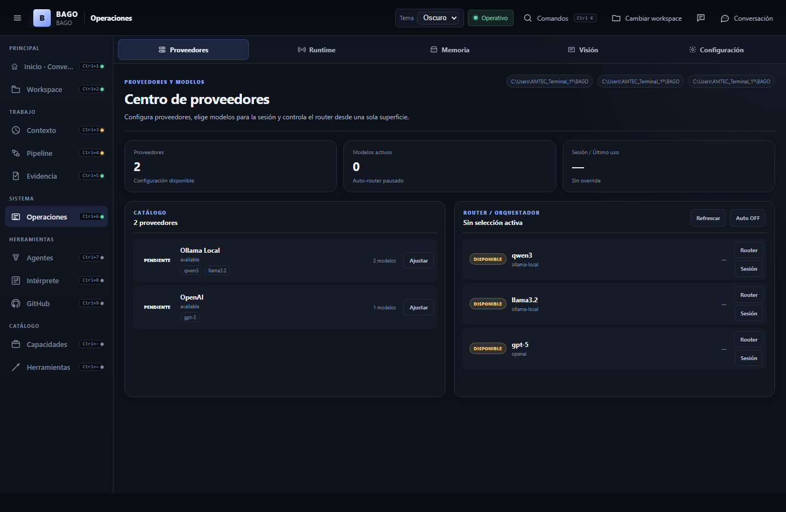

### Proveedores

Consulta providers configurados, modelos, disponibilidad y errores. Para cambiar
de provider usa el control de sesión de Inicio o la acción explícita del panel;
no confundas un provider listado con uno autenticado.

Profundiza en cada provider: disponibilidad, modelos, error más reciente,
health y si es el modelo efectivo de la sesión. Cambiar el selector de Inicio
no debe ocultar el provider real que aparece en el receipt.

### Runtime

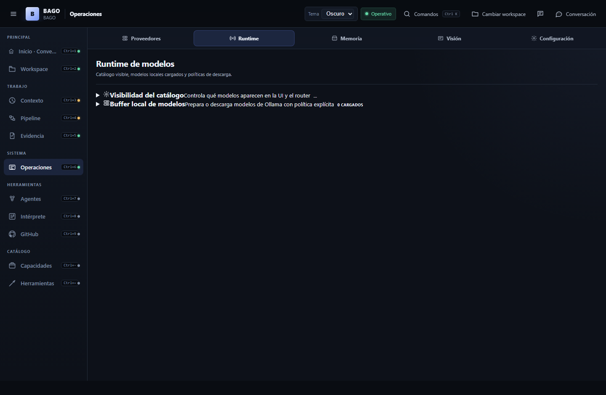

Muestra catálogo, modelos locales y políticas de descarga. Antes de descargar
comprueba espacio, origen, modelo y política; un catálogo grande no implica que
todos los modelos estén disponibles.

### Memoria

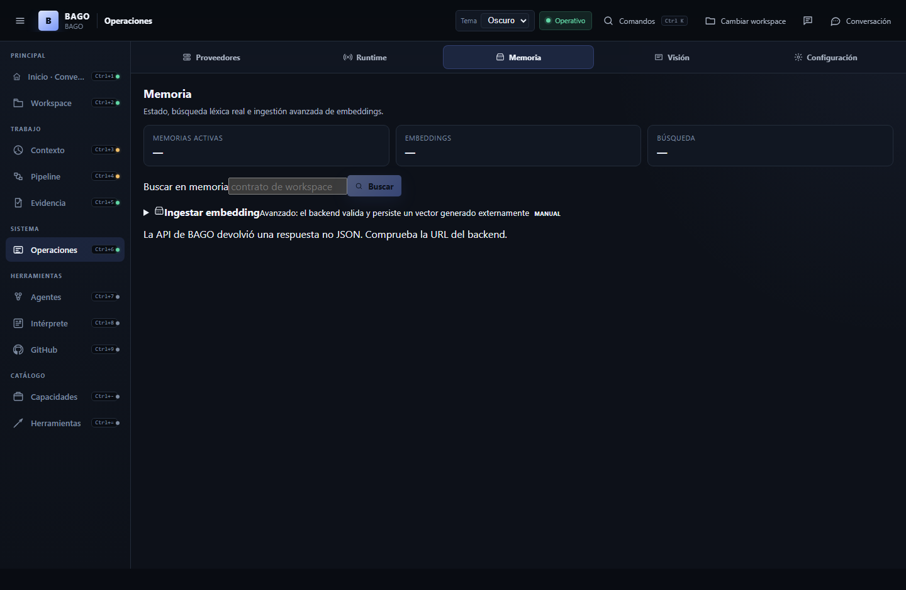

Consulta la memoria operativa y sus entradas. Añade solo material que quieras
persistir y revisa el workspace/state root mostrado.

### Visión

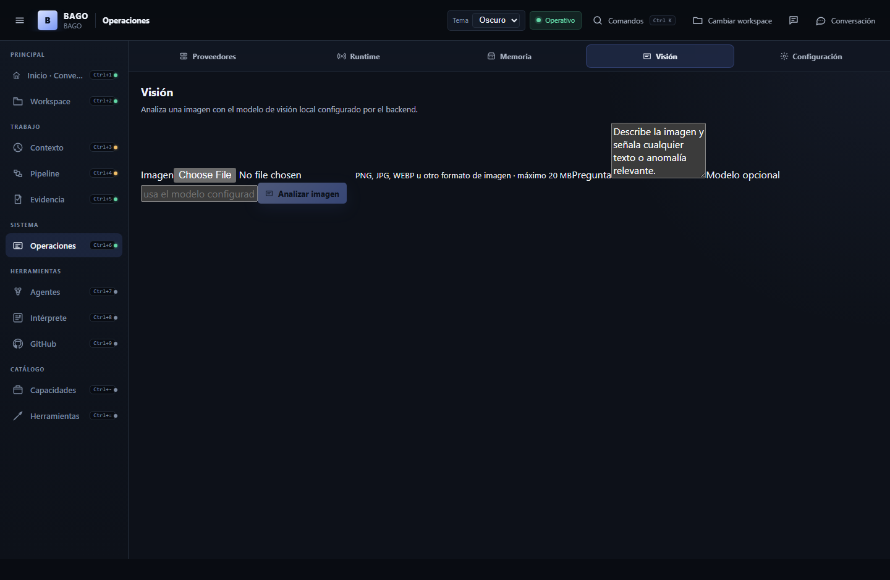

Adjunta una imagen, indica la pregunta y comprueba la respuesta. La visión es
un análisis del turno; no reemplaza la evidencia de archivos ni autoriza una
escritura.

### Configuración

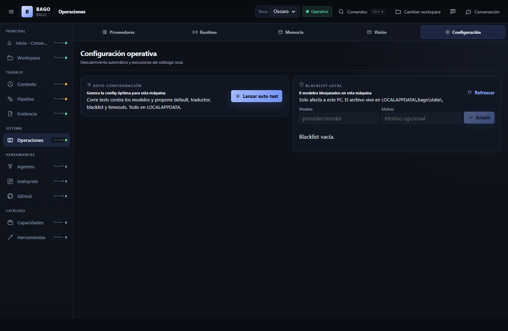

Incluye **Auto-config** y **Blacklist**:

- Auto-config: refresca, lanza prueba, revisa la propuesta y pulsa **Aplicar**
  solo después de comprobar modelos y resultado.
- Blacklist: añade un modelo con motivo, verifica la ida/vuelta y quítalo si
  deja de aplicar.

Recorre además los estados **en curso**, **cancelado**, **sin modelos**, **con
resultado parcial** y **aplicable** de Auto-config. En Blacklist comprueba
duplicados, motivo, fecha y efecto sobre el catálogo antes de quitar una
entrada.

## 8. Paneles laterales

Los paneles se abren desde el grupo **Herramientas/Catálogo**. No sustituyen al
flujo principal; son superficies auxiliares y se cierran con `Esc` o **Cerrar**.

### Agentes

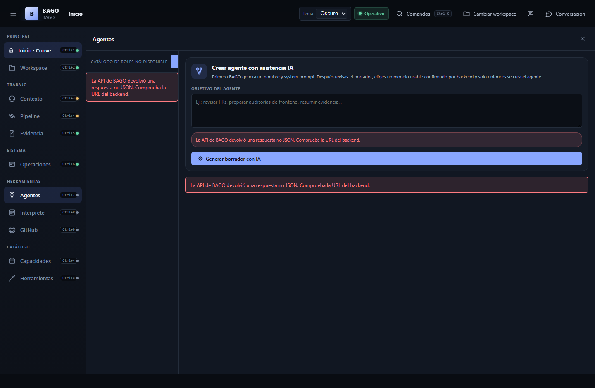

Edita nombre, prompt, provider/modelo, límites y habilitación. Guarda cambios,
comprueba la revisión y prueba el agente antes de usarlo en un Pipeline.

La ficha completa incluye identidad, prompt, capabilities, límites de tiempo y
tokens, provider/modelo, permisos, estado habilitado/deshabilitado, historial
de prueba y errores recientes. Guarda un cambio pequeño y confirma que la
revisión cambia antes de encadenarlo a un Pipeline.

### Intérprete (inspección técnica)

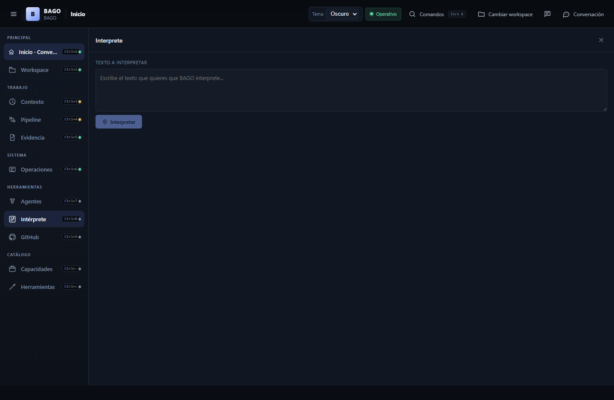

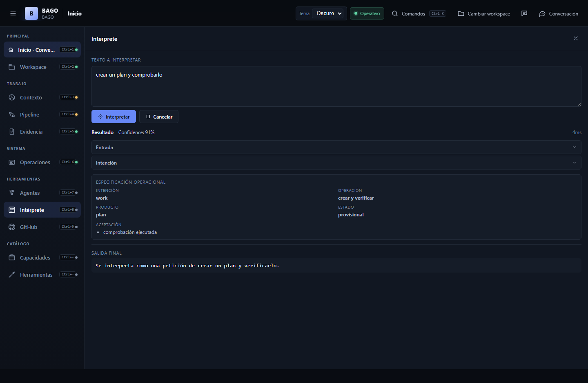

Escribe una pregunta y pulsa **Interpretar** para ver etapas de entrada,
normalización, intención, contexto, restricciones, routing, decisión y salida.
Este panel permite inspeccionar una interpretación aislada; el flujo normal del
chat ya interpreta cada turno antes de contestar y muestra esa ficha inline.

### GitHub

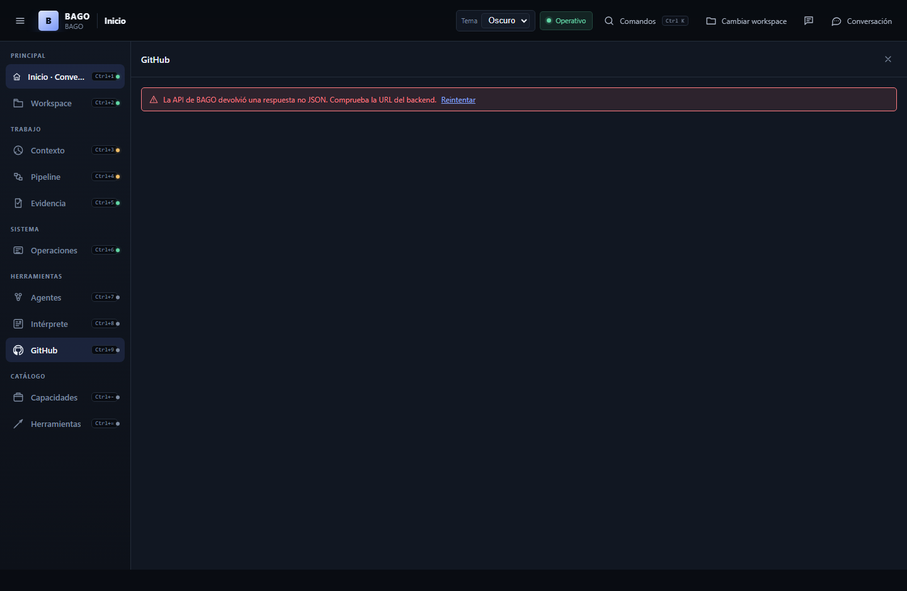

Consulta autenticación y scopes. Nunca pegues tokens en el chat ni interpretes
“conectado” como permiso de escritura si el scope concreto no lo confirma.

### Capacidades

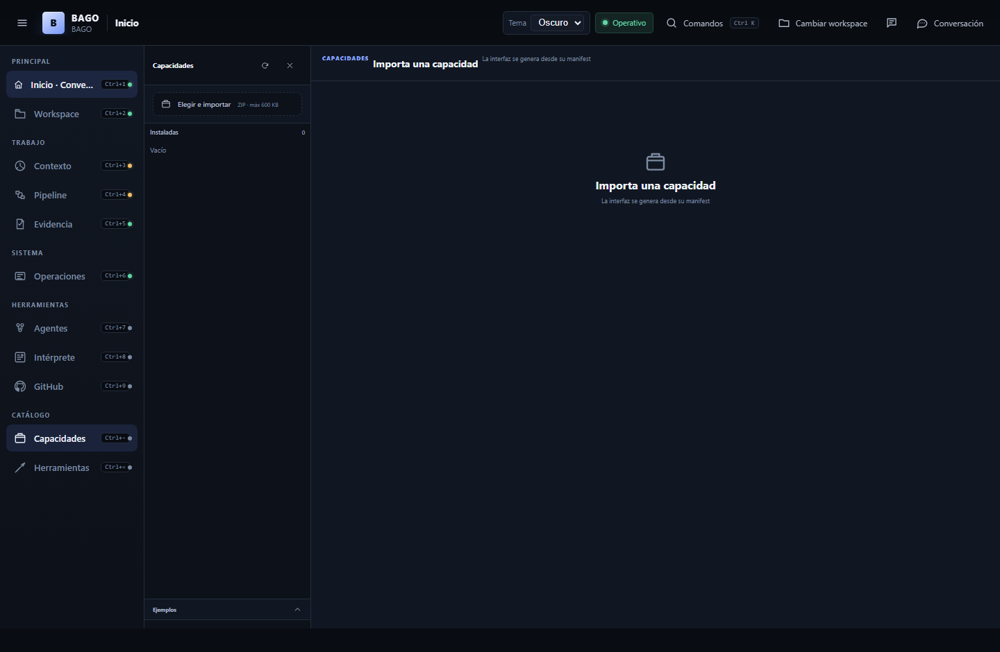

Consulta anatomía, contrato, inputs, outputs, riesgo y estado de activación de
una capacidad.

Abre cada capacidad para distinguir `available`, `configured`, `blocked` y
`disabled`; revisa ejemplos de input/output y el permiso requerido. La ficha
del catálogo no ejecuta la capacidad.

### Herramientas

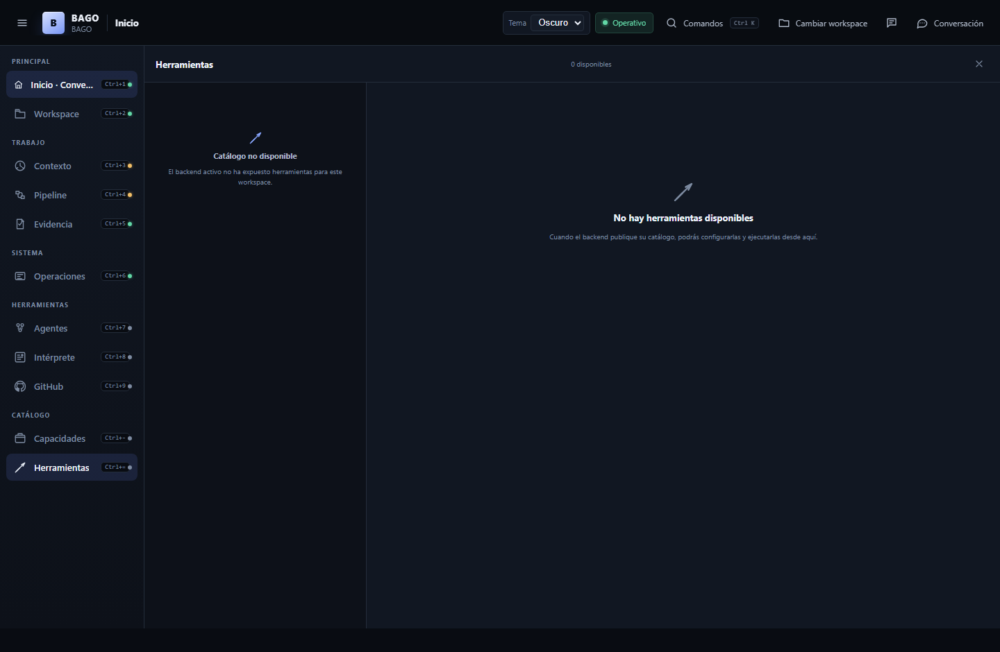

Lista las herramientas disponibles y sus límites. Leer/listar no equivale a
escribir/ejecutar: la autorización se decide por sesión y backend.

Para cada herramienta revisa operación, esquema de argumentos, side effects,
riesgo, timeout, workspace permitido y receipt esperado. Prueba primero una
operación de lectura y deja la escritura para una sesión expresamente
autorizada.

## 9. Ayuda, comandos y selector de workspace

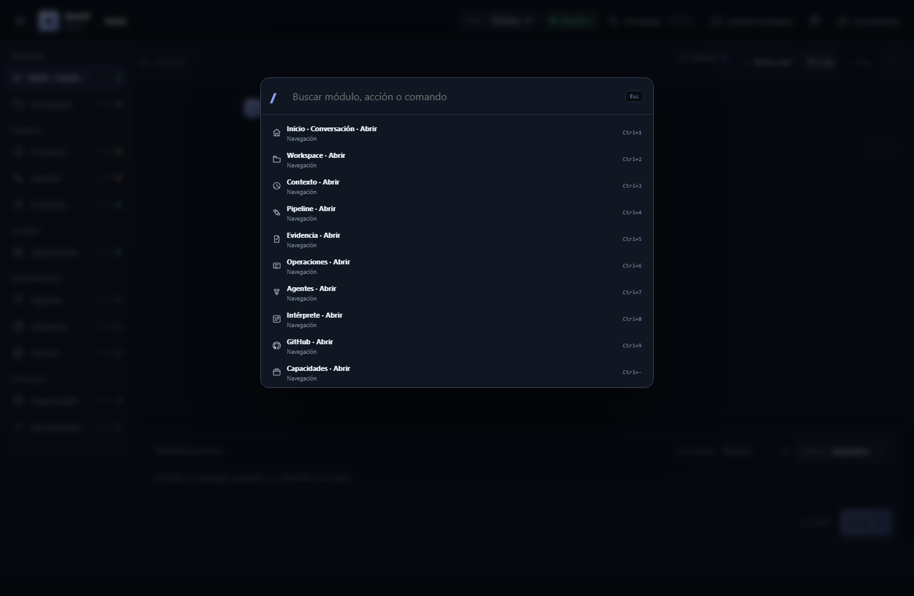

Pulsa `Ctrl+K`, busca una acción y confirma con `Enter`. La paleta navega o
ejecuta la acción declarada; `Escape` la cierra y devuelve el foco al control
anterior.

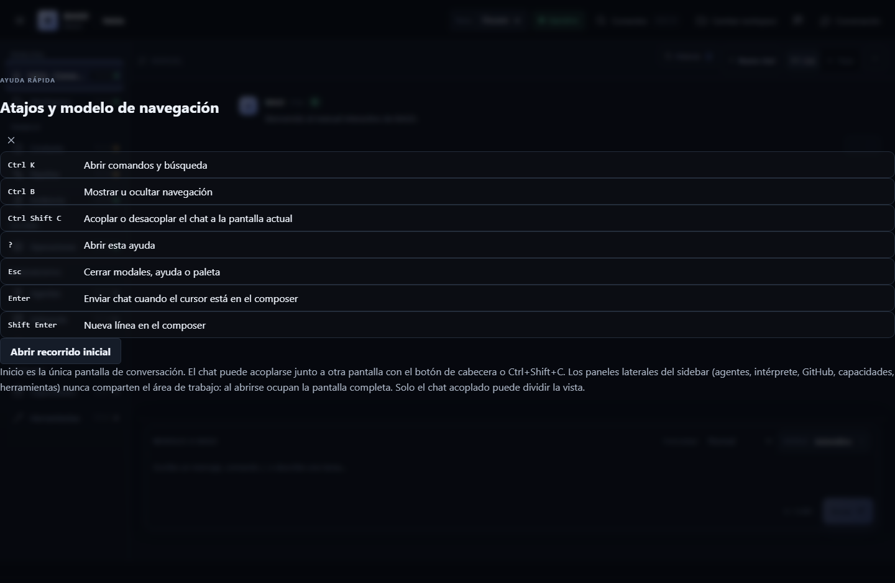

Pulsa `?` para consultar atajos. Los principales son `Ctrl+1` Inicio, `Ctrl+2`
Workspace, `Ctrl+3` Contexto, `Ctrl+4` Pipeline, `Ctrl+5` Evidencia, `Ctrl+6`
Operaciones, `Ctrl+B` sidebar y `Ctrl+K` comandos.

El selector de workspace aparece al elegir proyecto o cambiar workspace:
comprueba ruta, estado del manifest y propuesta de sembrado antes de confirmar.

## 10. Recetas completas

### A. Preguntar, interpretar y responder

1. Inicio → escribir la pregunta → Enviar.
2. Leer **Interpretación previa**.
3. Si falta un dato crítico, responder a la aclaración; no forzar una acción.
4. Leer la contestación y su provider/modelo.
5. Abrir el receipt desde el turno o Evidencia.

### B. Revisar un archivo y preparar un plan

1. Workspace → buscar archivo → abrir.
2. Menú contextual → **Añadir al contexto**.
3. Inicio → escribir objetivo y restricciones.
4. Pulsar **Preparar plan**.
5. Pipeline → Crear → revisar criterios → ejecutar solo con autorización.

### C. Ejecutar y cerrar con evidencia

1. Pipeline → Crear el objetivo y aceptación.
2. Ejecutar desde la vista de ejecución.
3. Esperar cada paso y resolver bloqueos explícitamente.
4. Evidencia → localizar receipt, claims y trazas.
5. Declarar únicamente el estado que demuestran las pruebas.

## 11. Alcance de las capturas de esta edición

La matriz siguiente fue generada el 2026-09-09 a 1440×940 con la UI actual y
un estado contractual simulado para hacer visibles las ramas y estados
intermedios de cada sección.
No representa por sí sola una certificación del backend ni del instalador.

| Grupo | Capturas |
|---|---|
| Inicio/Workspace/Contexto | `01-inicio-chat`, `01-inicio-historial-abierto`, `01-inicio-selector-modelo`, `02-workspace-explorador`, `02-workspace-archivo-seleccionado`, `02-workspace-menu-archivo`, `03-contexto-trabajo`, `04-contexto-api` |
| Pipeline | `05-pipeline-crear`, `05-pipeline-crear-objetivo`, `05-pipeline-revision-objetivo`, `pipeline-ejecuci-n`, `pipeline-flujo`, `pipeline-planes-y-programaci-n`, `pipeline-capacidades`, `pipeline-simulaci-n`, `pipeline-entrenamiento-rl` |
| Evidencia | `12-evidencia-recibos`, `13-evidencia-auditoria` |
| Operaciones | `14-operaciones-proveedores`, `operaciones-runtime`, `operaciones-memoria`, `operaciones-visión`, `operaciones-configuración` |
| Paneles | `panel-agentes`, `panel-intérprete`, `panel-interprete-resultado`, `panel-github`, `panel-capacidades`, `panel-herramientas` |
| Global | `24-paleta-comandos`, `25-ayuda-atajos` |

El manifiesto de captura es [manifest.json](evidence/manual-ui-20260909/manifest.json)
y registra 32 capturas sin errores de consola en esa ejecución. Las capturas
son evidencia visual de la UI renderizada con mock contractual; no sustituyen
la ejecución E2E real Electron/backend ni una auditoría automatizada de
accesibilidad.

Como complemento, la ejecución real de Electron/backend generó una matriz
independiente de 11 superficies (`electron-01` a `electron-11`) en el mismo
directorio. Consulta su [electron-manifest.json](evidence/manual-ui-20260909/electron-manifest.json):
`mode=real-electron-dev-backend`, `destinations=11`, `httpErrors=[]` y smoke
`ok=true`. La matriz contractual conserva las ramas de datos que el backend
real no siempre puede reproducir en una ejecución aislada.
